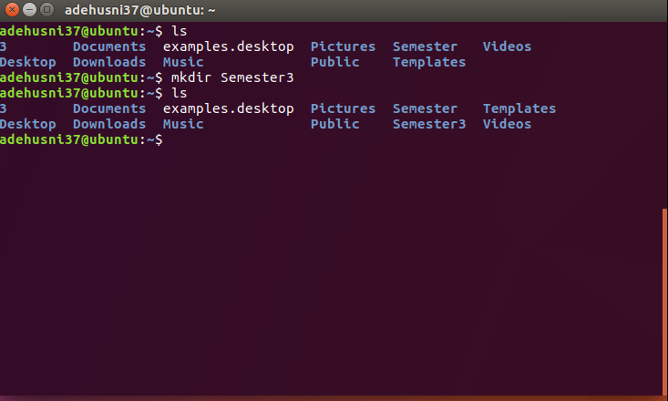
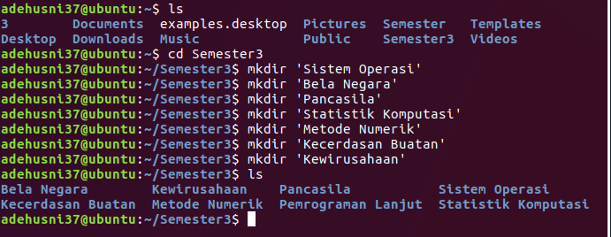
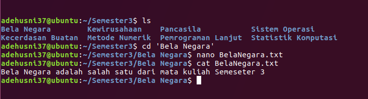
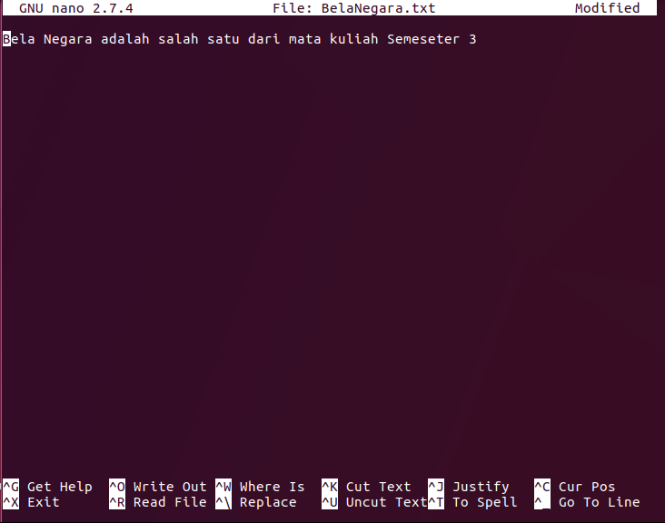

**MODUL 1 - BASH SCRIPTING DASAR**

**SOAL PRAKTIKUM**

Buatlah sebuah program dengan bahasa Shell dengan syarat hanya menggunakan
terminal :

1.  Buat direktori yang bernama Semester 3

2.  Buat direktori lagi didalamnya yang bernama masing-masing nama mata kuliah
    yang kalian ambil di Semester 3. Kemudian Beri deskripsi singkat melalui
    .txt pada masing masing direktori.

3.  install vokoscreen

**ANALISIS MASALAH**

Soal praktikum kali ini dapat diselesaikan cukup dengan menggunakan terminal.
Dengan cara menginputkan perintah untuk membuat direktori dari linux. Dan
mengginstall sebuah program dengan menggunakkan terminal saja.

**HASIL PRAKTIKUM**

Kode :

| ls mkdir Semester3 ls |
|-----------------------|

>   Gambar 1 - Hasil eksekusi dari kode sumber

Praktikan memberi nama file yang berisi kode sumber untuk menjawab soal
praktikum dengan nama folder ‘Semester3’. Praktikan mengeksekusi kode sumber
tersebut melalui terminal. Program awalnya menampilkan seluruh isi folder,
kemudian membuat folder baru, setelah itu menampilkannya lagi.

Kode sumber :

| ls cd Semester3 mkdir ‘Sistem Operasi’ mkdir ‘Bela Negara’ mkdir ‘Pancasila’ mkdir ‘Statistik Komputasi’ mkdir ‘Metode Numerik’ mkdir ‘Kecerdasan Buatan’ mkdir ‘Kewirausahaan’ ls |
|------------------------------------------------------------------------------------------------------------------------------------------------------------------------------------|

>   Gambar 2 - Hasil eksekusi dari kode sumber

Praktikan memberi nama file yang berisi kode sumber untuk menjawab soal
praktikum dengan membuat ditektori didalam folder ‘Semester3’. Praktikan
mengeksekusi kode sumber tersebut melalui terminal. Program awalnya menampilkan
seluruh isi folder, kemudian membuat folder baru, setelah itu menampilkannya
lagi.

Kode sumber :

| ls cd ‘Bela Negara’ nano BelaNegara.txt cat BelaNegara.txt |
|------------------------------------------------------------|

>   Gambar 4 - Hasil eksekusi dari kode sumber

Praktikan memberi txt file yang berisi deskripsi pada folder mata kuliah untuk
menjawab soal praktikum ini dengan membuat txt didalam folder Bela Negara.
Praktikan mengeksekusi kode sumber tersebut melalui terminal. Program awalnya
menampilkan text editor, kemudian membuat deskripsi mata kuliah, setelah itu
menampilkannya lagi. Cara ini dilakukan sampai folder mata kuliah terisi oleh
deskripsi txt.

**PEMBAHASAN DAN KESIMPULAN**

*Alhamdulillah* praktikum kali ini berjalan lancar tidak ada kendala yang
berarti.

 Bash merupakan penerjemah perintah yang berjalan pada konsol/command line
intrepeter di mana si pengguna dapat memberi perintah(command(s)) yang dapat
mengakibatkan sesuatu dalam sebuah sistem operasi berubah. Bash juga dapat
membaca perintah dari berkas yang disebut skrip. Dalam praktek kali ini belajar
membuat direktori (folder) menggunakan terminal, serta membuat file txt dan
menampilkanya.
